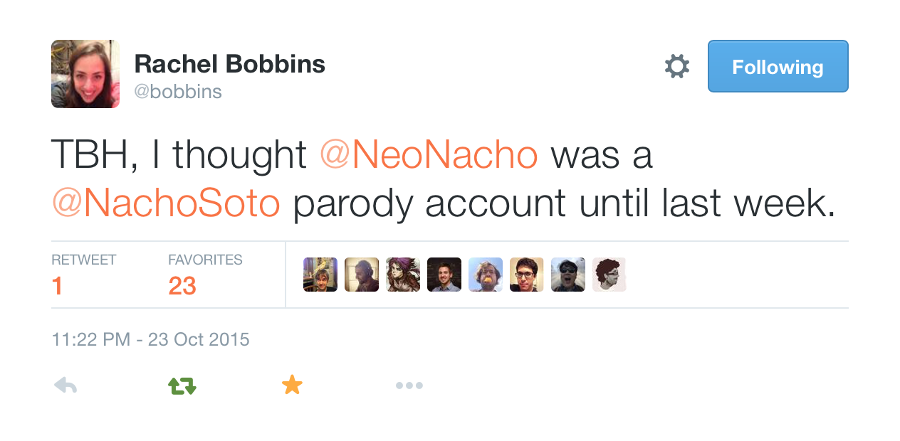
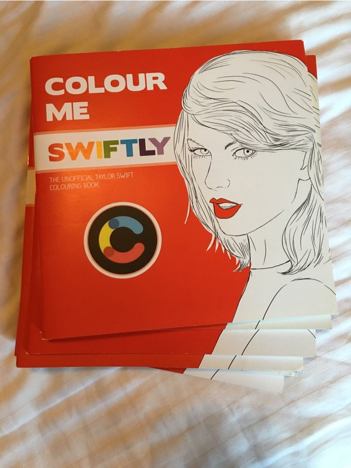
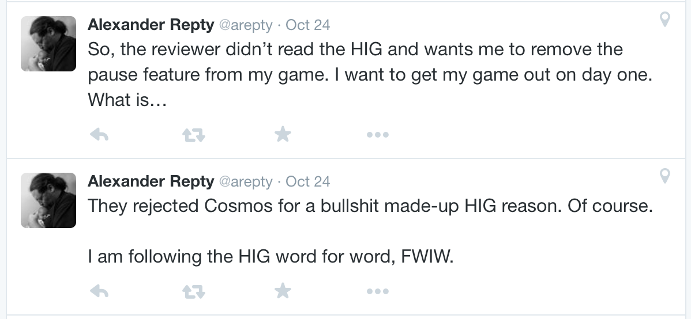

# Bring your app to the big screen

## Swift Summit, October 2015

### Boris Bügling - @NeoNacho


<!--- use Poster theme, black -->

---



---

## CocoaPods


---

## Contentful


---



---


---

> “‘I’d like to create an integrated television set that is completely easy to use,’ he told me. [...] ‘It will have the simplest user interface you could imagine. I finally cracked it.’”

---

## October 21, 2011


---

## September 9, 2015


---


---


---


The future of TV is iOS


---

Accelerate
AudioToolbox
AudioUnit
AVFoundation
AVKit
CFNetwork
CloudKit
CoreBluetooth
CoreData
CoreFoundation
CoreGraphics


---

CoreImage
CoreLocation
CoreMedia
CoreSpotlight
CoreText
CoreVideo
Darwin
Foundation
GameController
GameKit
GameplayKit


---

GLKit
ImageIO
MachO
MediaAccessibility
MediaPlayer
MediaToolbox
Metal
MetalKit
MetalPerformanceShaders
MobileCoreServices


---

ModelIO
OpenGLES
SceneKit
Security
simd
SpriteKit
StoreKit
Swift Standard Library
SystemConfiguration
UIKit


---

# WebKit


---

# MultipeerConnectivity


---

# Porting existing apps


---

# CocoaPods

- Supports tvOS since 0.39.0
- New platform:

```ruby
platform :tvos, '9.0'
```


---

# Pods supporting tvOS

```json
["AFNetworking","Alamofire","CocoaLumberjack","SwiftyJSON","Charts",
"Quick","Bolts","SnapKit","RxBlocking","RxCocoa","RxSwift","Nimble",
"Argo","UICKeyChainStore","AsyncSwift","DTFoundation","Sync",
"KeychainAccess","upnpx","AlamofireImage"]
```

If you are adventurous 👇

<https://github.com/orta/cocoapods-expert-difficulty>

---

# SpriteKit Example


---

# DOOM Classic

- UIKit changes (UIAlertView, UISlider)
- AudioSession isn't available
- Newer C++ compiler


---

# NIBs 😭


If you feel like copy-pasting stuff between NIBs 👇

<https://github.com/neonichu/DOOM-IOS2/tree/tvos>

---

# Storage limitations

- app is limited to 200 MB
- 500 KB of persistent storage (`NSUserDefaults`)
- Use iCloud
- Use On-Demand resources

---

# No direct manipulation


---

# Focus engine

```swift
UIButton().canBecomeFocused() // == true or false
UIButton().focused // == true or false
UIScreen.mainScreen().focusedView // nil or the view in focus
```

---

# Reacting to focus changes

```swift
func didUpdateFocusInContext(context: UIFocusUpdateContext,
	withAnimationCoordinator coordinator: UIFocusAnimationCoordinator)

context.nextFocusedView // the view which gets the focus
context.previouslyFocusedView // the view which had the focus

func addCoordinatedAnimations(_ animations: (() -> Void)?,
                   completion completion: (() -> Void)?)
```

---

# Demo


---

# Siri?


---

# Game Controllers


---


---

```swift
NSNotificationCenter.defaultCenter().addObserverForName(GCControllerDidConnectNotification,
		object: nil, queue: nil) { (note) in
	if let controller = note.object as? GCController {
    	if let microPad = controller.microGamepad {
        	microPad.dpad.valueChangedHandler = { (_, x, y) in
        		if let paddle = self.childNodeWithName("Paddle") {
        			paddle.position.y += CGFloat(y)
                }
            }
        }
    }
}
```

---

# Game Controllers work with UIKit components


---

# Siri remote is also a game controller

- Profile `GCMicroGamepad`
- Touch surface is a dpad
- Two action buttons
- Motion (`GCMotion`)
- Seems not to work in the simulator

---

> 2.27 If your app’s core functionality doesn’t work with the Siri remote it will be rejected. The app may, however, provide enhanced functionality in connection with a game controller or other peripheral

---

> A maximum of two game controllers (plus one remote) can be connected to an Apple TV at any given time.

---

# Demo


---

# TVML


---

# App Review 😭



---

# Conclusion

- tvOS works very well
- If you know UIKit, it's easy to start
- Think about interaction


---

# Resources

- <https://developer.apple.com/tvos/human-interface-guidelines/>
- "Ich glotz TV", @avbelow, Macoun 2015
- <https://github.com/contentful/tvful>
- <http://nerds.airbnb.com/tvos-focus-engine/>
- <https://eternalstorms.wordpress.com/2015/10/05/pair-the-apple-tv-developer-kit-siri-remote-with-xcodes-simulator/>

---

# Thanks!


---

@NeoNacho

boris@contentful.com

http://buegling.com/talks


