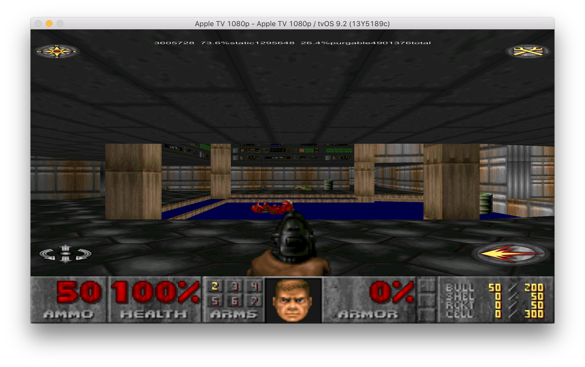

# 📺

## try! Swift, March 2016

### Boris Bügling - @NeoNacho


<!--- use Poster theme, black -->

^ Hi, I am Boris and today I'm going to talk about Apple TV

---


^ I'm coming from Berlin where we have this nice TV tower

---

## CocoaPods


^ I'm also a member of the CocoaPods core team

---

## Contentful


^ And I work for Contentful, which is a cloud-based CMS for web and mobile apps -- but since we want to bring content to any screen, there's of course also support for tvOS in our SDKs

---


^ tvOS was the second new platform Apple introduced last year, after watchOS. We are going to see some big differences between the two during the talk and one of them was that Apple was giving away developer kits like the one we see here.

---

> “‘I’d like to create an integrated television set that is completely easy to use,’ he told me. [...] ‘It will have the simplest user interface you could imagine. I finally cracked it.’”

^ This is a quote from Steve Jobs' biography which sparked a lot of rumors about an Apple-made TV set a few years ago. Since then, talk about an App Store on the Apple TV hasn't stopped.

---

## October 21, 2011


^ The quote we just saw was published the first time in October 2011.

---

## September 9, 2015


^ But it took until September 2015 for the final product to ship. We can take this as a reminder on how long it can take to really polish a product.

---


^ So, the future of TV is bugs

---


^ Just joking, the future of TV is apps, of course

---


The future of TV is iOS


^ But also, the future of TV is iOS. Both platforms have so many similarities that Apple is providing API diffs between iOS and tvOS. But let's have a closer look at what is available and what is not.

---


[^1]


[^1]: https://twitter.com/davidolesch/status/656126103921160192

^ This diagramm shows an overview of available frameworks. On the left hand side, we see the frameworks available only on iOS, in the middle we have the common frameworks and on the right are the TV specific ones. As we can see, there's only a few tvOS exclusive frameworks, dealing with TVML and top-shelf extensions. In the middle, we see the most important thing which is that tvOS apps use UIKit, there's no TV-centric UI library. Many of the non-available frameworks make sense, but let's see which important frameworks are missing.

---

# WebKit


^ A big one is WebKit. This causes a few issues, on the one hand because a lot of mobile apps rely on being able to show content from arbitrary webpages. Just as an example, a full-featured Twitter client is not really possible on the TV. The even more pressing issue is that many third-party services require authentication using a web-based OAuth flow. These kind of authentication schemes are simply impossible to do right now.

---

## MultipeerConnectivity


^ Another surprising omission is MultipeerConnectivity. This framework makes it easy to communicate locally between devices, it is the basis for things like AirDrop or Handoff. Wouldn't it make a lot of sense to locally share data between a TV and an iPhone app? This could for example be used for authentication, but it is only possible with lower level APIs.

---

# Storage limitations

- app is limited to 200 MB
- 500 KB of persistent storage (`NSUserDefaults`)
- Use iCloud
- Use On-Demand resources

^ Another big difference between existing iOS devices and tvOS is that there's no local storage for TV apps, except for 500KB of user defaults. Any other data needs to be stored using iCloud or other cloud services, because it is ephemeral. This goes so far that the standard `Documents` directory doesn't even exist, there is just cached or temporary data. Another change in terms of storage is that apps are limited to 200MB, any additional data needs to be provided as on-demand resources. This is a new concept introduced with iOS 9, which allows us to host a few GB per app on Apple's servers and download them on-demand, but if storage is getting tight and our app is not running, the OS will clear that data out and it needs to be re-downloaded. I'm guessing Apple does not really see users managing storage of their TV connected devices that's why it puts a little more work on developers to make sure any data can be purged and redownloaded.

---

# Porting existing apps


^ Next, let's have a look at porting existing apps and code to the TV.

---

# CocoaPods

- Supports tvOS since 0.39.0
- New platform:

```ruby
platform :tvos, '9.0'
```


^ CocoaPods of course supports tvOS as a new platform since version 0.39 and a lot of Pods have been updated to work on the TV. This is a manual step, though, even when no code changes might be required, pod authors still need to manually state in their podspec that they support tvOS.

---

# Pods not supporting tvOS

If you are adventurous 👇

<https://github.com/orta/cocoapods-expert-difficulty>

^ If a Pod you use does not support tvOS, yet, the podspec needs to be updated. If you're still prototyping and feel a little adventurous, you can install the "cocoapods-expert-difficulty" plugin by my friend and fellow CocoaPods team member orta which will ignore platform definitions completely. This is very brittle, though, make sure you only use it temporarily.

---

# SpriteKit Example


^ The first app I tried to port was a simple SpriteKit based Pac-Man game I wrote for a talk a few years ago. Since it already supported external game controllers on iOS, the port was done by just creating a new target with the right platform, no coding was required.

---



<!-- Planning to have a video/gif or brief demo here -->

^ Next I did a port of another familiar game

---

# DOOM Classic

- UIKit changes (UIAlertView, UISlider)
- AudioSession isn't available
- Newer C++ compiler


^ The source for the iOS version of DOOM Classic was on GitHub and it felt like a nice example of a codebase which is reasonably portable - DOOM probably runs on your toaster by now - yet definetely not modern in terms of iOS SDK or frameworks being used. It was still fairly easy to do in a few hours over two evenings for a version which ran on the TV. The big points were some UIKit changes 
related to unavailable or deprecated controls like UIAlertView, which has been replaced by UIAlertController and UISlider which is not available. The same was true for AudioSession and there were a bunch of changes related to a newer C++ compiler being used these days, but those would have also applied when updating to support a newer version of iOS. To actually make it playable, new controls needed to be implemented, of course.

---

# NIBs 😭


If you don't feel like copy-pasting stuff between NIBs 👇

<https://github.com/neonichu/bohne>

^ One thing that was fairly annoying was DOOMs use of NIBs, though, which were used for the menus and settings screens. Since I will not be able to actually ship this, I didn't care too much about them being usable, but also didn't want to spend a lot of time removing them. However, iOS NIBs cannot be used on the TV at all and there is no migration. For this purpose, I wrote a small tool which will transform the XML of existing NIBs into tvOS ones, as the differences are actually fairly miniscule. There is still the issue of correcting the geometry, but at least they are working without manual intervention or copy & paste. The menus ended up being super tiny because of absolute sizes being used, but I did not have to deal with them anymore. So overall, porting works fairly well.

---

# No direct manipulation


^ Alright, how do we actually control tvOS apps? Obviously, there's no direct manipulation, TVs don't have touchscreens and even if they did that would be fairly impractical. Instead, there's a new remote, called the Siri remote, which sports a smallish, clickable touchpad and a microphone. But how this work together with UIKit controls?

---

# Focus engine

```swift
UIButton().canBecomeFocused() // == true or false
UIButton().focused // == true or false
UIScreen.mainScreen().focusedView // nil or the view in focus
```

^ To accomodate this, there's a new concept called Focus. At any given time, exactly one view on screen can have the focus. There's a new method `canBecomeFocused()` which tells the Focus engine which views can potentially be focused and there's properties to check which view currently has the focus. Using gestures, the user can move the focus and clicking on the touchpad will perform an action on the currently focused view.

---

# Demo


^ Let's look how this looks like in practice. We have a simple Storyboard with two buttons, a custom view which is focusable and a label. The buttons are stock UIKit buttons without any customized behaviour, the effect we see when switching between them is built into UIKit. Our custom view however implements special behaviour when coming in and out of focus, we will see how to implement this in a moment. Finally, the label is not focusable by default, there's nothing we have to do here. Now back to the slides.

---

# Reacting to focus changes

```swift
func didUpdateFocusInContext(context: UIFocusUpdateContext,
	withAnimationCoordinator coordinator: UIFocusAnimationCoordinator)

context.nextFocusedView // the view which gets the focus
context.previouslyFocusedView // the view which had the focus

func addCoordinatedAnimations(_ animations: (() -> Void)?,
                   completion completion: (() -> Void)?)
```

^ UIKit on tvOS contains a new protocol called `UIFocusEnvironment` which defines a few additional methods which deal with focus movement and updates. One of them is `didUpdateFocusInContext:withAnimationCoordinator:` which is called whenever focus has been updated. The protocol is implemented by `UIView`, so we can implement the method to gain custom behaviour for our view. We can use the `nextFocusedView` and `previouslyFocusedView` properties to determine which way the focus has moved and then add coordinated animations for the color change that we just saw. A coordinated animation ensures that our own animations are done in sync with the ones provided by the system without relying on any hardcoded timings.

---

## CustomFocusView

```swift
class CustomFocusView: UIView {
    override func canBecomeFocused() -> Bool {
        return true
    }
}
```

---

## CustomFocusView

```swift
override func didUpdateFocusInContext(context: UIFocusUpdateContext, 
	withAnimationCoordinator
	coordinator: UIFocusAnimationCoordinator) {
        coordinator.addCoordinatedAnimations({
            // ...
    	}, completion: nil)
    }
```

---

## CustomFocusView

```swift
let duration = UIView.inheritedAnimationDuration()
UIView.animateWithDuration(duration, animations: {
    if context.nextFocusedView == self {
      self.backgroundColor = UIColor.redColor()
    }

    if context.previouslyFocusedView == self {
      self.backgroundColor = UIColor.whiteColor()
    }
})
```

---

# Debugging focus

```swift
print(view.performSelector("_whyIsThisViewNotFocusable"))
```

e.g. for a `UILabel`

```
Unmanaged<AnyObject>(_value: ISSUE: This view has
userInteractionEnabled set to NO. Views must allow user
interaction to be focusable.
ISSUE: This view returns NO from -canBecomeFocused.
)
```

^ So what do we do if we are testing our application and a certain view cannot be focused despite we think it should be? There's a few techniques we can use. First, there's a private method called `_whyIsThisViewNotFocusable` which gives us some textual feedback on what the focus engine knows about a particular view. In this case, we can see the output for a label, which states that it does not have user interaction enabled. In addition to that, it also returns `NO` from `canBecomeFocused`, so a label can actually never be focused because of that.

---

# Good places for breakpoints

```swift
func shouldUpdateFocusInContext(_ context: UIFocusUpdateContext) -> Bool
func didUpdateFocusInContext(_ context: UIFocusUpdateContext,
    withAnimationCoordinator coordinator: UIFocusAnimationCoordinator)
```

^ If you still have issues with the behaviour of the focus engine in your application, you can start setting breakpoints in the `shouldUpdateFocusInContext` or `didUpdateFocusInContext` methods and look at the `UIFocusUpdateContext` to see how focus moves around between views. This should usually allow you to figure out what is going wrong.

---

# Gestures and button presses

```swift
let tapRecognizer = UITapGestureRecognizer(target: self,
	action: "tapped:")
let pressTypes = [NSNumber(integer: UIPressType.PlayPause.rawValue)]
tapRecognizer.allowedPressTypes = pressTypes;
self.view.addGestureRecognizer(tapRecognizer)

let swipeRecognizer = UISwipeGestureRecognizer(target: self,
	action: "swiped:")
swipeRecognizer.direction = .Right
self.view.addGestureRecognizer(swipeRecognizer)
```

^ In addition to the default behaviour of the focus engine and pressing the trackpad, you might want to implement some custom reactions to button presses or even trackpad gestures. For this, another familiar API is used -- `UIGestureRecognizer`. You can define custom tap gesture recognizers which fire when certain buttons are pressed on the remote, except for the Siri and the home button which are reserved by the system. Or you can implement custom swipe gesture recognizers, pretty similar to how you would do it on iOS.

---

# Lower-level API: `UIPress`

Very similar to `UITouch`-based API in iOS

```swift
func pressesBegan(presses: Set<UIPress>, withEvent event: UIPressesEvent?)
func pressesEnded(presses: Set<UIPress>, withEvent event: UIPressesEvent?)
func pressesChanged(presses: Set<UIPress>, withEvent event: UIPressesEvent?)
func pressesCancelled(presses: Set<UIPress>, withEvent event: UIPressesEvent?)
```

^ In addition to that, there's also the more low-level `UIPress` based API. This corresponds more or less to the `UITouch` based API on iOS, with callbacks for when presses begin, end, change or are cancelled. Using both of these, you can implement a tailored user experience for your app using the Siri remote.

---

# Text input


^ Now we come to the first real pain point of the Apple TV, text input. Unfortunately, this feels even worse than on the previous Apple TV, because the on-screen keyboard is now one long row of keys, instead of a grid. Presumably, this is because swipe gestures let you move quickly from one side to the other, but in my experience, it is way too common to overshoot. Because of this, you should really keep text input to an absolute minimum in order to not frustrate your users, especially when they may have just downloaded your app.

---

# Siri?


^ OK, but what about Siri you might say? That worked pretty well as text input on the watch, right? Unfortunately, the use of Siri and the microphone is limited to the system itself at this point in time, so no luck here.

---

# Handoff is also not supported


^ Another solution you might think off is using Handoff with a companion app on the user's iPhone, but this is also not supported at the moment.

---

-


<https://github.com/rsattar/Voucher>

^ If your main use case for text input is authentication, I would recommend a nice library called Voucher. It uses Bonjour to connect to a companion app on the phone, pretty similar to how we might imagine MultipeerConnectivity to work if it was available. Once the connection is established, you can send authentication tokens or some similar shared secret to the TV version of your app and then connect the user without any tedious text input.

---

# Game Controllers


^ Speaking about input, a pretty big use case for the Apple TV is games and for that, third party bluetooth controllers are supported. Those are the same controllers supported by iOS devices since iOS 7, but only the so called Extended Gamepad profile is available.

---


^ Since there is a pretty detailled spec for these official controllers, they all pretty much look the same, which is also very close to controllers for the Xbox if you have ever seen one. There's a dpad, two thumbsticks and various face- and shoulder-buttons. Pretty much what you would expect for playing a modern videogame on a console.

---

# Siri remote is also a game controller

- Profile `GCMicroGamepad`
- Touch surface is a dpad
- Two action buttons
- Motion (`GCMotion`)
- Seems not to work in the simulator

^ Implementing these in your app is done using the Game Controller framework and a pretty nice feature compared to iOS is that the Siri remote itself can also be treated as a game controller. This makes it possible to just implement one control scheme to support both the third-party controllers and the standard remote. Since the remote has far fewer inputs than the existing supported controllers, a new profile called `GCMicroGamepad` has been introduced in which the touch surface acts as a dpad and there are two action buttons. The remote also includes motion sensors which can be utilized using the `GCMotion` profile. While you can pair the remote with your Mac to control the simulator, this has not worked for me with the Game Controller framework, so you will have to test that stuff on the device.

---

```swift
NSNotificationCenter.defaultCenter().addObserverForName(GCControllerDidConnectNotification,
		object: nil, queue: nil) { (note) in
	if let controller = note.object as? GCController {
    	if let microPad = controller.microGamepad {
        	microPad.dpad.valueChangedHandler = { (_, x, y) in
        		if let paddle = self.childNodeWithName("Paddle") {
        			paddle.position.y += CGFloat(y)
                }
            }
        }
    }
}
```

^ Let's take a look at how we can implement support for game controllers. We can listen for the `GCControllerDidConnectNotification` which is posted once a controller is recognized by the device. We can then check which profiles it supports, where `microGamepad` is the most minimal which is supported by any kind of controller. There's a block-based API build around so-called `valueChangedHandlers` which we use to get X and Y movements to move around an element on screen.

---

# Game Controllers work with UIKit components


^ The other nice part of the third party game controllers is that they also work with UIKit components and the regular responder chain. So if a part of your game is built using UIKit, the dpad of the controller can be used to move the focus around. One less thing to worry about.

---

> 2.27 If your app’s core functionality doesn’t work with the Siri remote it will be rejected. The app may, however, provide enhanced functionality in connection with a game controller or other peripheral

^ Unfortunately, there's also a big downside regarding more complex games. Even though the third-party controllers have more axis and buttons, the App Store review guidelines forbid requiring one of them. Any app or game needs to also work with just the Siri remote.

---


^ This can lead to certain types of apps not even being made for the TV, like this developer who creates an emulator for a retro console called the Vectrex. Since games for that require more buttons, they couldn't really make it work as a tvOS game.

---

> A maximum of two game controllers (plus one remote) can be connected to an Apple TV at any given time.

^ Another interesting tidbid regarding multiplayer games is that there's a maximum of three concurrent players, one using the remote and two others using game controllers. This is a bit odd considering other modern gaming consoles usually support four simultaneous players.

---

# Demo


^ I have another demo, a small SpriteKit game using game controllers. It was mostly done using the new SpriteKit editor added in Xcode 7 with just the code we saw earlier to control the paddle. It is pretty nice to see that it is possible to prototype small games now directly in Xcode, without almost any code.

---

# TVML


^ One final way to write apps for the Apple TV is TVML. This is a framework for creating template based UIKit apps using some XML and Javascript. I'm not going into detail on this in this talk due to time constraints, but for catalogue-like apps, this might be a nice option for rapid development and it also allows changing the logic remotely, without App Store submission.

---

# Conclusion

- tvOS works very well
- If you know UIKit, it's easy to start
- Think about interaction


^ OK, in conclusion, we can say that the first version of tvOS already works really well when we compare it to things like the watch. If you got frustrated with trying out new Apple platforms after it, I would urge you to check tvOS out. It is also quite easy to start if you already know UIKit and chances are that you can reuse a bunch of code from existing apps. But keep in mind to think about interaction and not let people type in huge amounts of text or complicated passwords with their remote.

---

# Resources

- <https://developer.apple.com/tvos/human-interface-guidelines/>
- "Ich glotz TV", @avbelow, Macoun 2015
- <https://speakerdeck.com/toco/intro-to-tvos>
- <http://nerds.airbnb.com/tvos-focus-engine/>
- <https://eternalstorms.wordpress.com/2015/10/05/pair-the-apple-tv-developer-kit-siri-remote-with-xcodes-simulator/>
- <https://github.com/contentful/tvful>

^ Here some resources I have used which you can check out to learn more about developing for Apple TV. Especially Apple's human interface guidelines are very good, as usual.

---

# Thanks!


^ And with that, thanks for listening!

---

@NeoNacho

boris@contentful.com

http://buegling.com/talks


^ If you have any feedback, questions or want to talk about using Contentful, this is how you can reach me.
